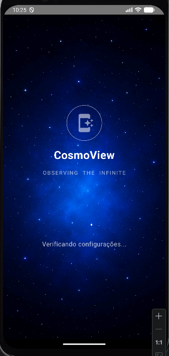
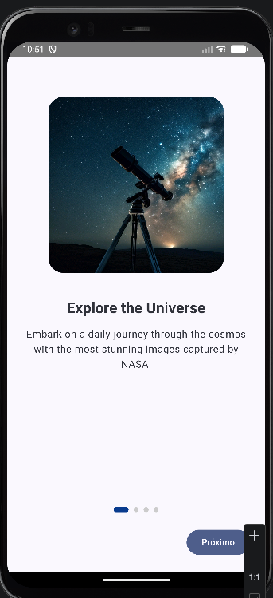
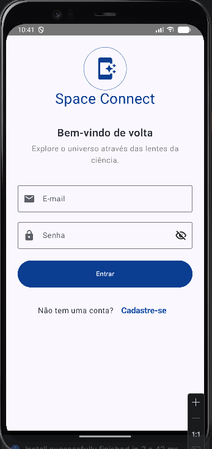
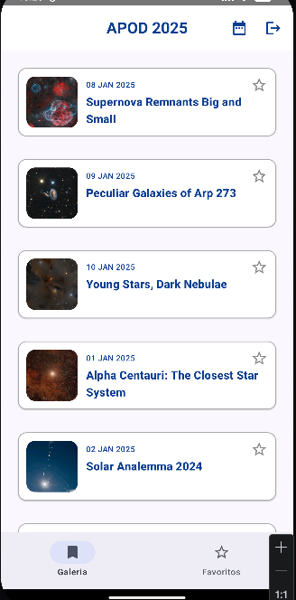
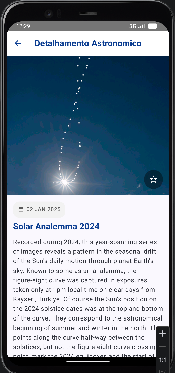
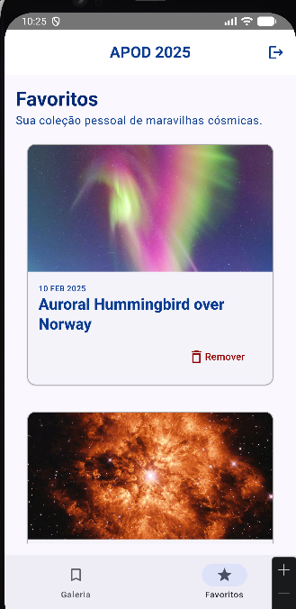

# 🌌 Space Connect - Global Solution

**Space Connect** é uma aplicação Android desenvolvida como parte da Global Solution da FIAP. O objetivo do projeto é conectar entusiastas do espaço às maravilhas do universo, utilizando dados reais fornecidos pela NASA para oferecer uma experiência educativa e imersiva.

---

## 🚀 Descrição da Solução
A aplicação permite que os usuários explorem o "Astronomy Picture of the Day" (APOD) da NASA. Com uma interface moderna e intuitiva construída em Jetpack Compose, o usuário pode visualizar imagens astronômicos diários, ler descrições detalhadas escritas por astrônomos profissionais, favoritar suas descobertas favoritas para acesso offline e pesquisar eventos cósmicos por data.

### Tema da Global Solution
**Space Connect:** Facilitando o acesso à informação científica e inspirando a próxima geração de exploradores espaciais através de tecnologia mobile de ponta.

---

## 📱 Fluxo de Telas
1.  **Splash Screen:** Tela inicial com o logo e animação de carregamento enquanto as configurações são validadas.
2.  **Onboarding:** Sequência de boas-vindas apresentando as funcionalidades principais da aplicação.
3.  **Autenticação (Login/Cadastro):** Sistema seguro para identificação do usuário utilizando Firebase Auth.
4.  **Lista Astronômica (Home):** Feed de descobertas espaciais com rolagem infinita.
5.  **Detalhes:** Informações completas sobre uma imagem específica, incluindo título, data e explicação detalhada.
6.  **Favoritos:** Galeria pessoal do usuário contendo as maravilhas cósmicas salvas localmente no dispositivo.

---

## 📸 Screenshots
Aqui estão os registros visuais da aplicação:
### Splash Screen

| Splash | Onboarding | Login |
| :---: | :---: | :---: |
|  |  |  |

| Home (Lista) | Detalhamento | Favoritos |
| :---: | :---: | :---: |
|  |  |  |

---

## 🛠️ Tecnologias e API Utilizada
### API
- **NASA APOD API:** Interface oficial que fornece dados astronômicos diários, incluindo imagens de alta resolução e metadados científicos.

### Stack Técnica
- **Linguagem:** Kotlin
- **Interface:** Jetpack Compose (UI Declarativa)
- **Injeção de Dependência:** Koin
- **Rede:** Retrofit & OkHttp
- **Banco de Dados Local:** Room (Para persistência de favoritos)
- **Carregamento de Imagens:** Coil (com otimização de memória para imagens 4K)
- **Navegação:** Compose Navigation
- **Autenticação:** Firebase Auth

---

## 🏗️ Arquitetura
O projeto segue os princípios da **Clean Architecture**:

-   **Domain Layer:** Contém as entidades de negócio e Use Cases, sendo totalmente independente de frameworks externos.
-   **Data Layer:** Implementação dos repositórios, fontes de dados (Remote com Retrofit e Local com Room) e Mappers.
-   **Presentation Layer:** State holders (ViewModels) e componentes de UI (Composables) que reagem às mudanças de estado.

---

## 👨‍💻 Desenvolvedores
- **Felipe Lima Bonato Testa** – RM: 553780
- **Rodrigo Silva Rocha** – RM: 552857
- **Thiago Luiz Pereira** – RM: 553720

---

## 🎥 Pitch e Demonstração
Confira o vídeo de apresentação da solução e a demonstração das funcionalidades:

https://www.youtube.com/watch?v=V75YywlTELU

---
© 2025 Space Connect - FIAP Global Solution